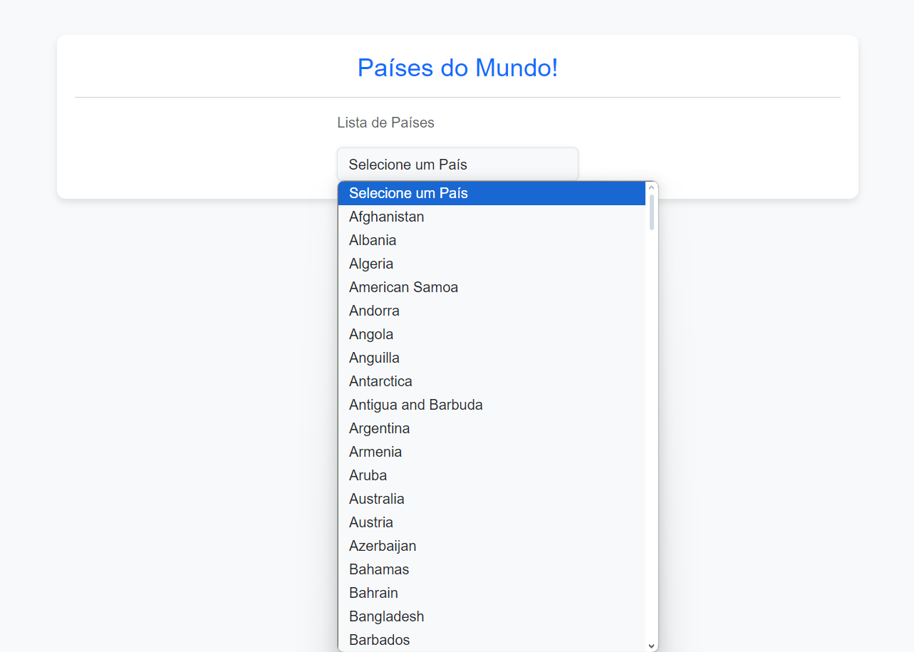
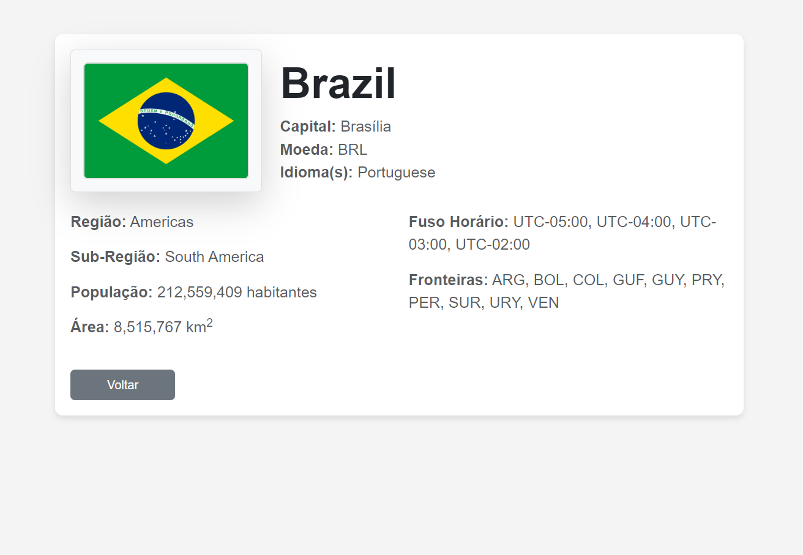

<h3 id="inicio"></h4>

# API dos Países

Este projeto consome a API pública de países para exibir informações sobre os países do mundo, como nome, capital, população, área e região. O sistema permite pesquisar informações sobre um país específico ou visualizar uma lista de todos os países.

## Funcionalidades

- **Listar todos os países:** Exibe uma lista de países disponíveis.
- **Consultar um país específico:** Ao selecionar um país, o sistema exibe informações detalhadas sobre ele, como:
  - Nome
  - Capital
  - Região
  - Sub-região
  - População
  - Área
  - Imagem da bandeira

## Tecnologias Utilizadas

- PHP
- cURL
- HTML
- Bootstrap (para o design responsivo)

## Estrutura do Projeto

```
API
  /inc
      /header.php           # Cabeçalho da página
      /footer.php           # Rodapé da página
      /routes.php           # Definição de rotas
      /api_consumer.php     # Classe para consumir a API
  /scripts
      /home.php             # Página inicial que lista todos os países
      /country.php          # Página com detalhes sobre o país selecionado
      /404.php              # Página de erro 404
  index.php                # Arquivo principal que gerencia as rotas
images
README.md
```

## Como Usar

1. Clone o repositório:

   ```bash
   git clone https://github.com/malobr/Consume-Contries-API.git
   ```

2. Acesse a pasta do projeto:

   ```bash
   cd API
   ```

3. Abra o arquivo `index.php` em um servidor local (como XAMPP, WAMP, ou PHP embutido).

4. Acesse `http://localhost/index.php?route=home` para ver a lista de países.

5. Para ver os detalhes de um país, selecione o país na lista ou acesse diretamente:

   ```
   http://localhost/index.php?route=country&country_name=NomeDoPais
   ```

---

## Imagens do Sistema

Este é o sistema em funcionamento:

<p align="center">
  
  
  
</p>

<a href="#inicio">Voltar para o início</a>

